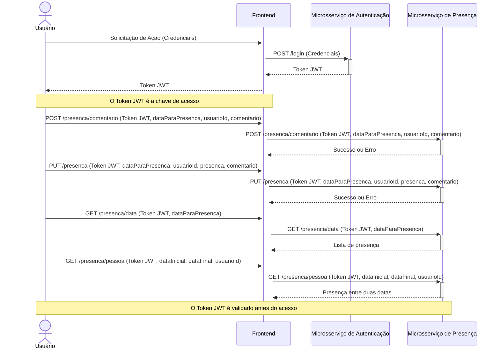

# Diagrama de fluxo de presença

```mermaid
sequenceDiagram
    actor User as Usuário
    participant Frontend as Frontend
    participant AuthMicrosservice as Microsserviço de Autenticação
    participant PresencaMicrosservice as Microsserviço de Presença
    
    User->>+Frontend: Solicitação de Ação (Credenciais)
    Frontend->>+AuthMicrosservice: POST /login (Credenciais)
    AuthMicrosservice-->>-Frontend: Token JWT
    Frontend-->>User: Token JWT
    
    note over User,Frontend: O Token JWT é a chave de acesso
    
    User->>+Frontend: POST /presenca/comentario (Token JWT, dataParaPresenca, usuarioId, comentario)
    Frontend->>+PresencaMicrosservice: POST /presenca/comentario (Token JWT, dataParaPresenca, usuarioId, comentario)
    PresencaMicrosservice-->>-Frontend: Sucesso ou Erro

    User->>+Frontend: PUT /presenca (Token JWT, dataParaPresenca, usuarioId, presenca, comentario)
    Frontend->>+PresencaMicrosservice: PUT /presenca (Token JWT, dataParaPresenca, usuarioId, presenca, comentario)
    PresencaMicrosservice-->>-Frontend: Sucesso ou Erro

    User->>+Frontend: GET /presenca/data (Token JWT, dataParaPresenca)
    Frontend->>+PresencaMicrosservice: GET /presenca/data (Token JWT, dataParaPresenca)
    PresencaMicrosservice-->>-Frontend: Lista de presença

    User->>+Frontend: GET /presenca/pessoa (Token JWT, dataInicial, dataFinal, usuarioId)
    Frontend->>+PresencaMicrosservice: GET /presenca/pessoa (Token JWT, dataInicial, dataFinal, usuarioId)
    PresencaMicrosservice-->>-Frontend: Presença entre duas datas

    note over User,PresencaMicrosservice: O Token JWT é validado antes do acesso

```
