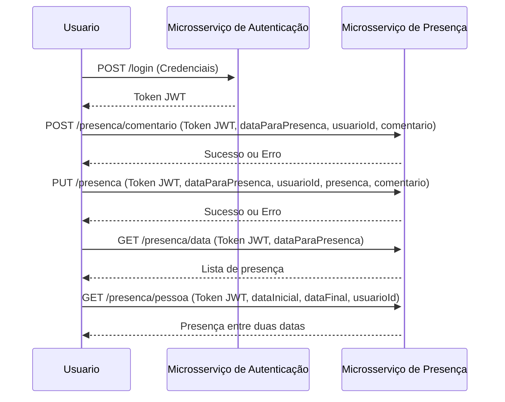

```mermaid
sequenceDiagram
    participant Usuario
    participant AuthService as Microsserviço de Autenticação
    participant PresencaService as Microsserviço de Presença
    
    Usuario->>+AuthService: POST /login (Credenciais)
    AuthService-->>Usuario: Token JWT

    Usuario->>+PresencaService: POST /presenca/comentario (Token JWT, dataParaPresenca, usuarioId, comentario)
    PresencaService-->>Usuario: Sucesso ou Erro

    Usuario->>+PresencaService: PUT /presenca (Token JWT, dataParaPresenca, usuarioId, presenca, comentario)
    PresencaService-->>Usuario: Sucesso ou Erro

    Usuario->>+PresencaService: GET /presenca/data (Token JWT, dataParaPresenca)
    PresencaService-->>Usuario: Lista de presença

    Usuario->>+PresencaService: GET /presenca/pessoa (Token JWT, dataInicial, dataFinal, usuarioId)
    PresencaService-->>Usuario: Presença entre duas datas

```